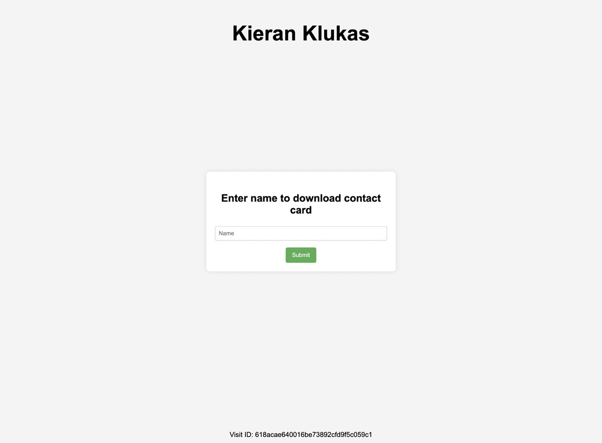
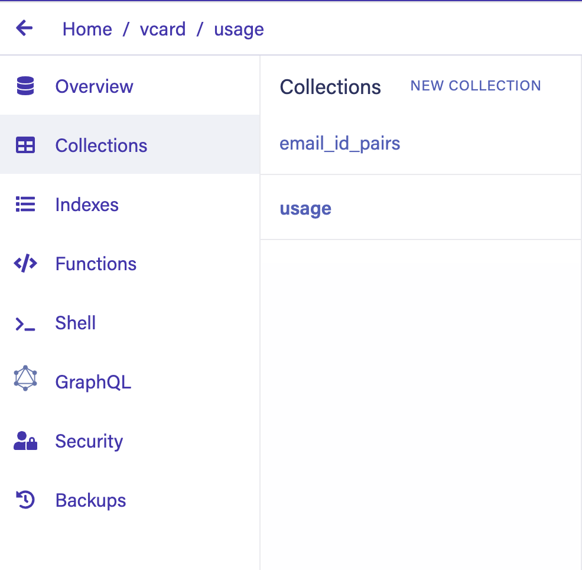
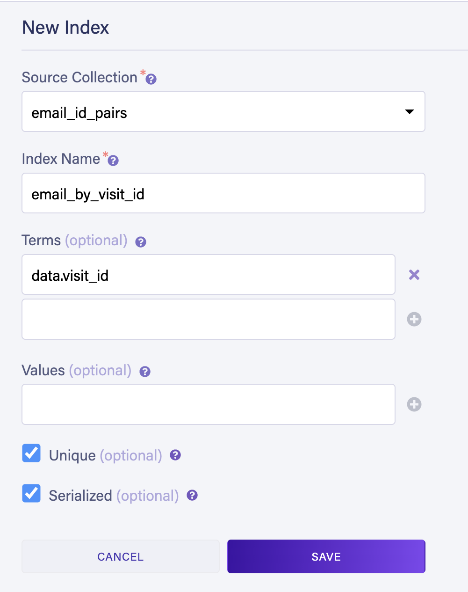
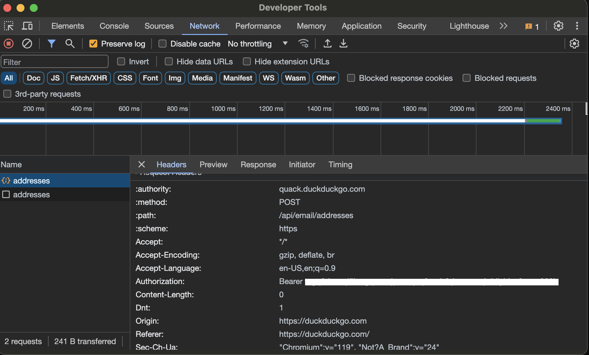
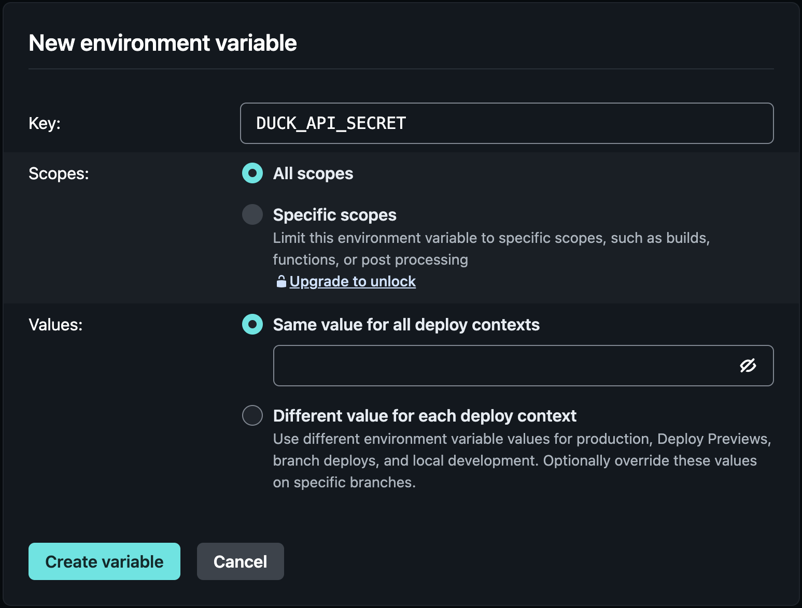

# DuckDuckGo email dynamic .vcf generation [](https://app.netlify.com/start/deploy?repository=https://github.com/kcoderhtml/ddg-vcf)

# Introduction
This project dynamically generates a .vcf file with a new duck address for each unique hardware id. It was designed for the OnBoard event hosted by Hack Club.



# Installation

1. First you want to create your own copy of the repo by clicking the deploy to netlify button above. 
2. Next configure your details in the [config/template.vcf](config/template.vcf) file. Edit the below lines but don't touch any of the other lines.
   ```vcf
   N:Klukas;Kieran;;;
   FN:Kieran Klukas
   BDAY:2008-04-27
   GENDER:male
   NICKNAME:kieran
   URL;TYPE=HOME:https://kieranklukas.com
   URL;TYPE=SOCIAL:https://www.youtube.com/@wanderer.archives
   URL;TYPE=SOCIAL:https://scrapbook.hackclub.com/Kieran
   ```
3. Change the photo in [config/template.vcf](config/photo.jpeg) to be your own photo. Ensure that it is 320x320px or smaller and it is a jpeg file.
4. Connect FaunaDB to your acount by running the commands below and following the prompts.
   ```bash
   netlify addons:create fauna
   netlify addons:auth fauna
   ```
5. Create two collections in Fauna `email_id_pairs` and `usage`
    
6. Create a new index in Fauna named `email_by_visit_id` with the settings shown in the image below:
    
7. Get your DuckDuckGo email protection api key by going to [https://duckduckgo.com/email/settings/autofill](https://duckduckgo.com/email/settings/autofill) and copying the token in the Authorization field:
    
8. Add the api key to the Netlify environment variables for your site with the name `DUCK_API_SECRET`:
    
9. Profit! You can add the url of your netlify site to your nfc card and share it with people to give them your contact information while still retaining the privacy of your email and the ability to remotely disable that specific address.

# License
This repositories code is licensed with the GNU AFFERO GENERAL PUBLIC LICENSE you can view it [here](LICENSE.md)
